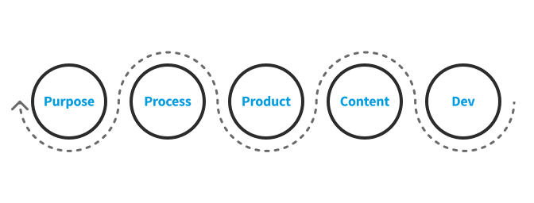

# IxDF System

The IxDF System consists of processes and tools that the Interaction Design Foundation (IxDF) use
to [achieve our purpose](/achieve-purpose/README.md) by [coordinating efforts](/coordinate-efforts/README.md)
to [develop software](/development/README.md), create content and [design products](/design-products/README.md).

This site is our living documentation, used daily by our teams, and shared openly with anyone who finds it useful.
