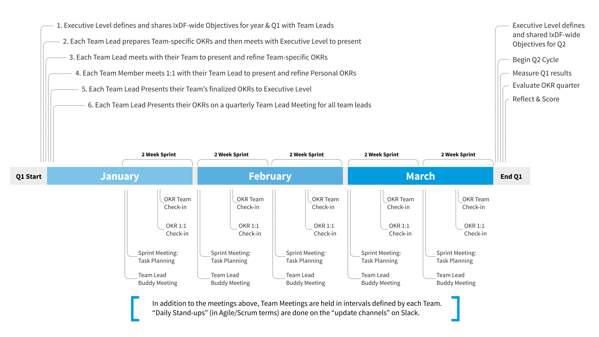
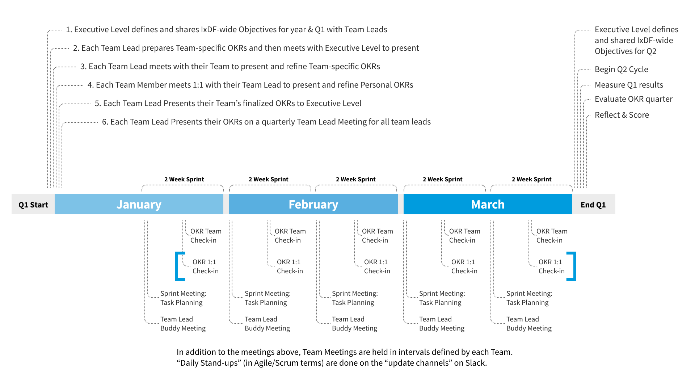

# Stay Aligned as a Team

## Hold a Quarterly OKR Meeting

The Quarterly OKR Planning Meeting

- The Team Lead makes a new entry for a new quarter for their team by creating a new section in the first tab of the spreadsheet “IxDF OKR Planning.xlsx”
- The Team Lead closely studies the IxDF-wide Objectives
    - The Team Lead takes a call with the IxDF Executive Level and asks questions. The better aligned we are, the smoother everything goes.
- The Team Lead fills out all OKRs for their team as best as possible.
    - This is a concentration-demanding and lengthy process. It requires strategic overview, long-term thinking, and the ability to constantly switch mindset from “strategic, high-level, long-term thinking” to “concrete execution-level work”.
    - Expect this to take up to a full day of high-concentration work – perhaps spread out over several days if your brain starts to burn.
- The Team Lead meets with the Executive Level to verify and refine the Team’s OKRs.
- The Team Lead then meets with their Team where the Team Lead presents the plan for the next quarter.
- Each Team Member then develops Personal OKRs based on the Team’s OKRs.
- Each Team Member meets 1:1 with the Team Lead to verify and refined their Personal OKRs.

## Prepare Yourself for a Sprint Planning Meeting

_Note: We use Agile/Scrum in all our teams. It’s really just a fancy word for something simple so don’t be scared about the terminology or think you need to read books about it. There is some background information on how the Dev Team uses Scrum on https://handbook.interaction-design.org/guides/scrum/_

Prepare yourself before a Sprint Planning Meeting
1. Go to the Spreadsheet “IxDF OKR Planning.xlsx”.
2. If this is your first time, then please CAREFULLY STUDY the tab “Sprint Planning Template” – and read all the “help bubbles”.
3. Find the tab in the spreadsheet called “Sprint Planning Team XYZ” where “XYZ” is your Team.
4. If that tab doesn’t exist, then create a copy of the tab “Sprint Planning Template” can call it “Sprint Planning Team XYZ” where “XYZ” is your Team.
5. Start editing/adding your tasks based on the instructions in the “help bubbles”

## Hold a Sprint Planning Meeting

**Attendees**: All Team Members in a Team. The Team Lead acts in the role of “Scrum Master”.

**Periodicity**: Bi-weekly (every 2 weeks) in the week where the “OKR Check-in Meeting” is NOT held.

**Duration**: 5-20 minutes per person – or 2 hour maximum for the whole team.
**Important**: Keep the meeting full of energy and ambition. Don’t speak slowly or go into too much detail unless it’s relevant to others. Everyone should leave the meeting excited – not drained!

**Purpose**: Have a clean, balanced, exciting, and ambitious plan of significant tasks / to dos for the coming 2 weeks.

Hold the Sprint Planning Meeting

- The Team Lead says welcome and reminds everyone that:
- The meeting should be full of energy and ambition – not drain our energy.
- “You get out what you put in”. Work is like any other aspect of life: The more energy and ambition you put into it, the more it will give back. Positivity, energy, excitement are intentional states of mind…. and this meeting is your chance to add that your work life.
- Preparation is key and everyone needs to prepare thoroughly before these meetings: If not, the meetings will be “yada yada” and drain everyone’s energy.
- Everyone takes turns and presents their Sprint Planning.
- Share your screen so you can point at the item you are talking about
- At the end of the meeting, everyone will have visibility into what their Team Members are doing. We will we able to move forward like a Team of Leaders.

## Do a Daily Standup

“Daily standups” are – in Scrum/Agile Terminology – a daily meeting in the morning where all Team Members give a short update on 3 key things:
- What have you accomplished since last meeting?
- What are your plans for today?
- Is anything blocking you?

Because we value concentration time so much, we’ve decided to skip the Daily Standup meetings – and then use the “Update channels” on Slack instead.

This will only as long as everyone consistently remembers to submit their updates at the end (or beginning) of their work day.

## Prepare for Bi-Weekly OKR 1:1 Check-in Meeting

All the weeks where there is NOT a Sprint Planning meeting, you hold a “1:1 OKR Check-In” with your Team Lead.
This is your chance to get a good, relationship-building conversation with your Team Lead and to report progress on your OKRs.
This is how you prepare:
- For each Key Result you own you make an update in our OKR spreadsheet. That way, we all head into our OKR meetings with a fully updated OKR spreadsheet.
- [add more things to do as preparation here, e.g. questions to ask yourself]

## Hold the Bi-Weekly Team-wide OKR Check-in Meeting

_Held bi-weekly, i.e. on the weeks where there is NOT a Sprint Planning meeting, right after the 1:1 Check-ins_

After the Team Lead has had a round 1:1 OKR check-ins, it’s time for the Team-wide OKR Check-in Meeting.

This Team-wide meeting could be the day after the 1:1 Meetings or on the same day. Just make sure that you

If you already have a recurring Team-wide meeting, then hold this “Team-wide OKR Check-in Meeting” at the same time. There’s no reason for having too many meetings.
