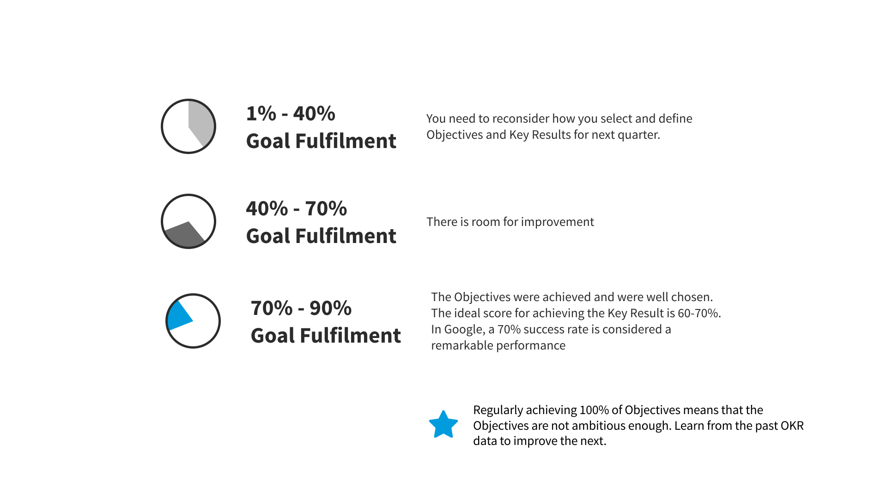
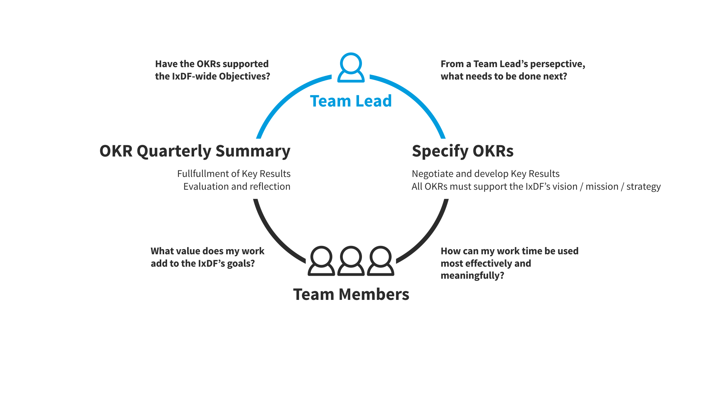

# Assess Your OKRs

By the end of the quarter, you and your Team give each Key Result a final score, and reflect on your OKRs as a whole. Using a retrospective approach, pose some (or all) of these questions to your Team:

-   Were our Objectives ambitious enough?
-   Were our Key Results measurable? Did we know what our baseline was at the start of the quarter?
-   Did we “set ’em and forget ’em”? If so, why?
-   Were our OKRs aligned with the IxDF’s broader strategies?
-   Did they keep us focused on delivering value to customers?
-   Did we feel connected to our OKRs?
-   What have we learned from this quarter? How do we lift the bar moving into the coming quarter?

## Hold the Quarterly Meeting

At the end of each quarter, you evaluate your own and your Team’s OKRs in order to measure your accomplishment

## The Meeting

