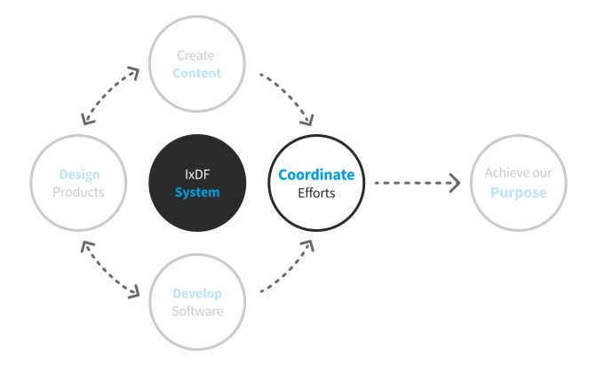

# Coordinate Efforts

When you have a grand global [vision](/outdated/achieve-purpose/vision.md)
and a [mission](/outdated/achieve-purpose/mission.md) to achieve that vision with the highest possible quality
at the lowest possible cost for millions of people, you are only going to succeed with hard work and great team coordination.

To achieve this at the IxDF, we hire unicorn team members, maintain a high-performance culture,
and use frameworks like scrum, agile and OKRs (Objectives and Key Results).

If you are not already familiar, you can learn more [about OKRs](./00-why-okrs),
or about the [benefits of OKRs](./00-benefits-of-okrs).

If you are already familiar and want to start using OKRs as an IxDF staff,
please start with [our OKR cadence](./01-okr-cadence).
