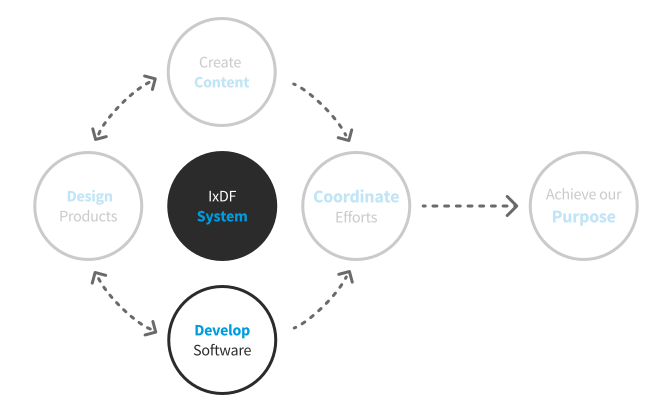

# Develop Software

At IxDF, we're building an open and transparent company, full of people who love their work and enjoy the challenges they face every day.
To achieve this, we want everyone to understand what is expected of them, the things we value and the things we believe should be avoided.

## Table of Contents

-   Guides
    -   [Onboarding](/guides/onboarding/README.md)
    -   People Operations
        -   [Team Trips](/guides/people-operations/team-trips.md)
        -   [Video Calls](/guides/people-operations/video-calls.md)
    -   [Scrum](/outdated/scrum/README.md)
    -   [Our expectations from you and your work](/guides/roles/senior-developer.md)
    -   [Collaboration tools](/guides/collaboration-tools.md)
-   Library
    -   [Back end](/library/backend/README.md)
    -   [Front end](/library/frontend/README.md)

## Links

-   [Handbook contribution guide](/CONTRIBUTING.md): how to make this document even better 🦄
-   🔒 Shared folders at [Dropbox.com](https://www.dropbox.com/share/) (ask **@mads** to give you access)
-   [🔒 developer docs](https://github.com/InteractionDesignFoundation/IxDF-web/blob/main/docs/README.md) - development-related documents

## The IxDF Zen Code

🦄
