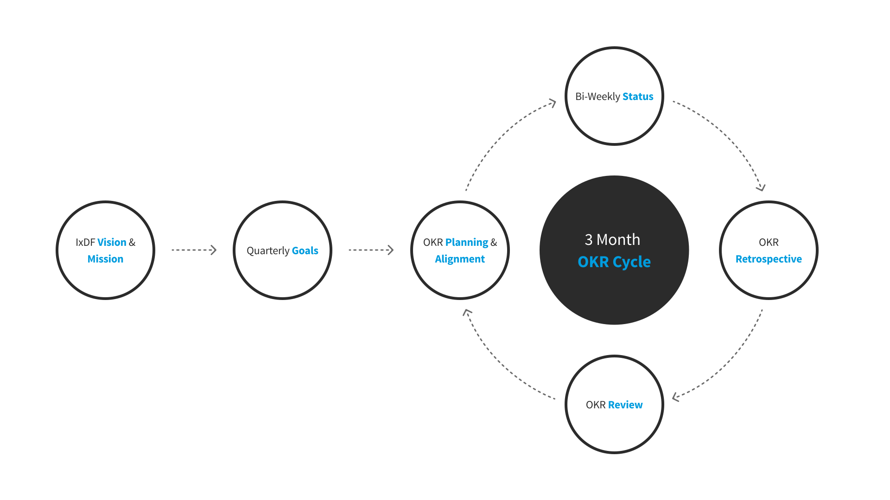
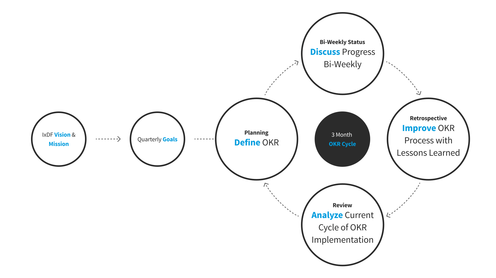
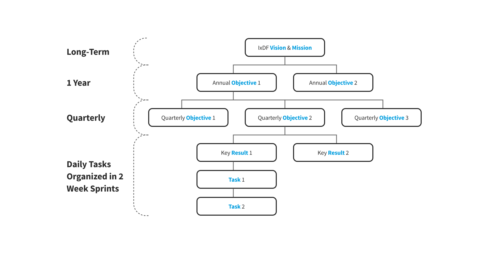
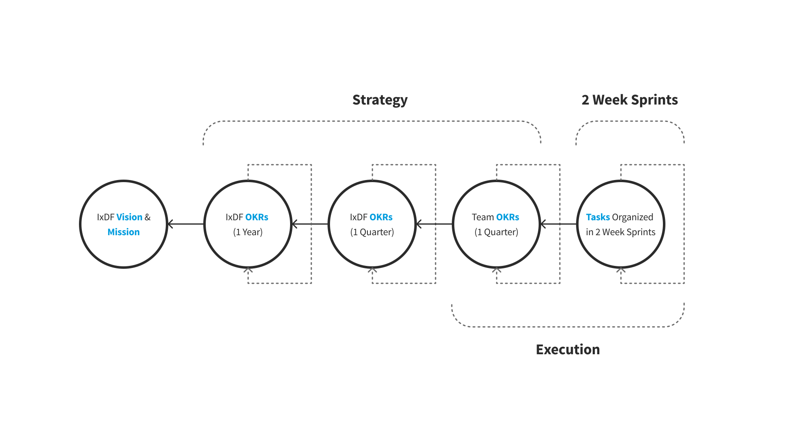
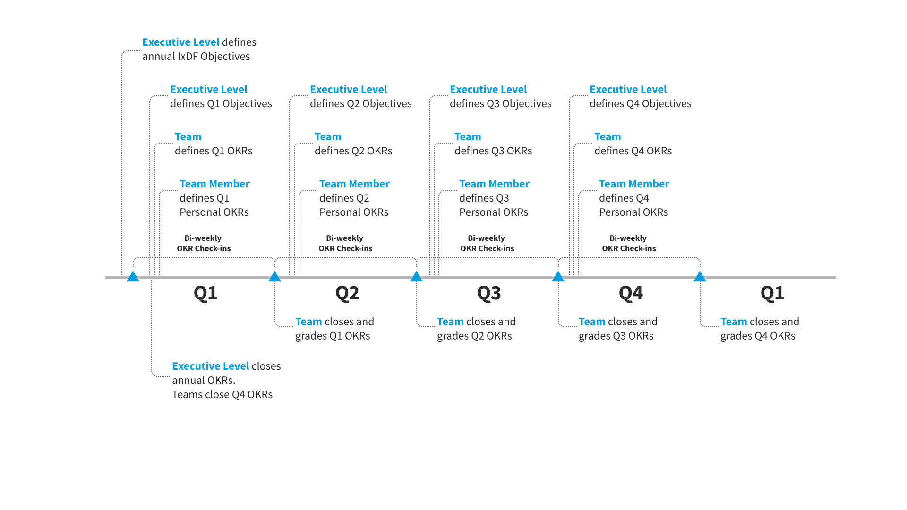
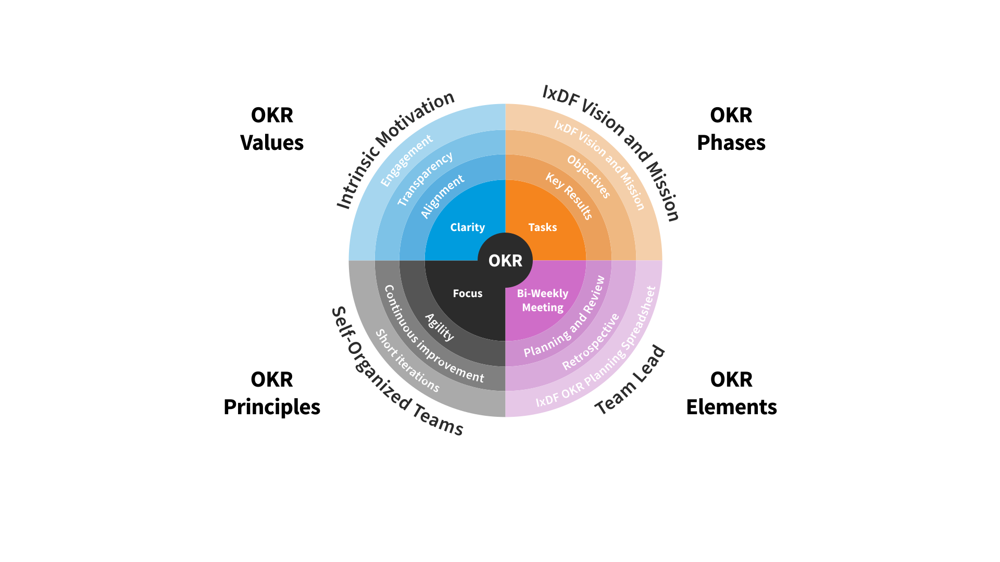
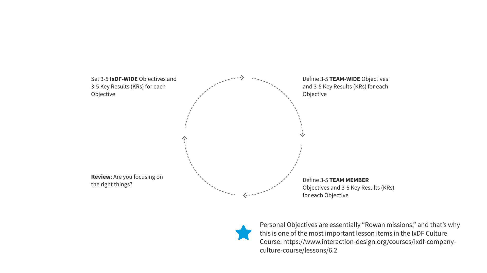
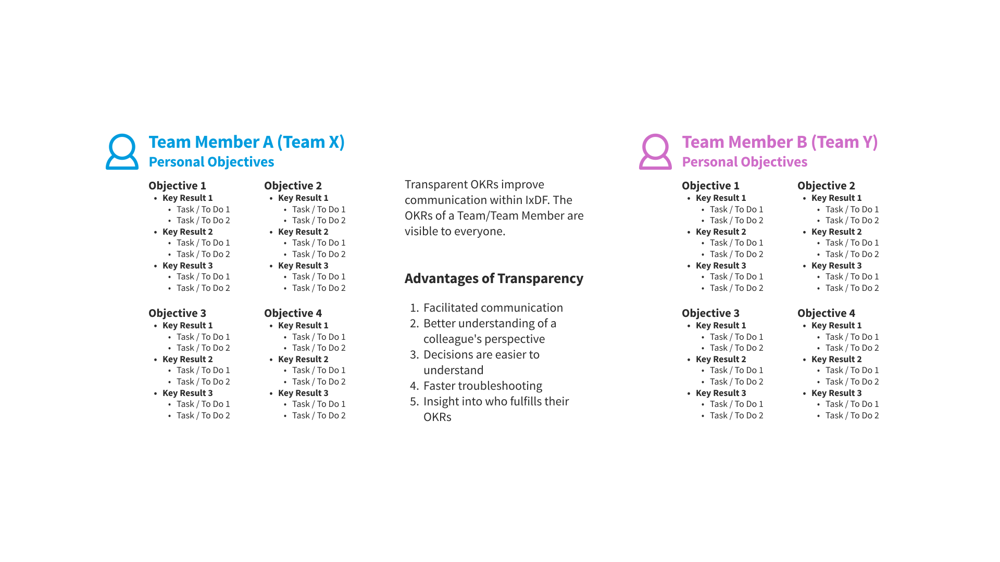
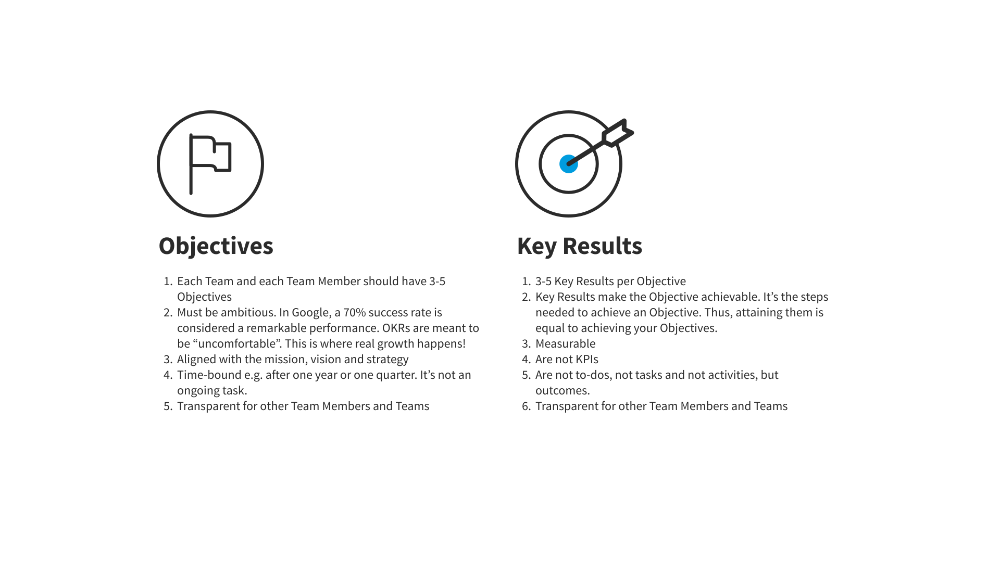

# How the IxDF Uses OKRs

## The IxDF Quarter

## The OKR Year and Quarter

## The OKR Year

## Pillars of the OKR Method

## How We User OKRs In Our Teams

## Transparency

## Your OKRs — Your Checklist

