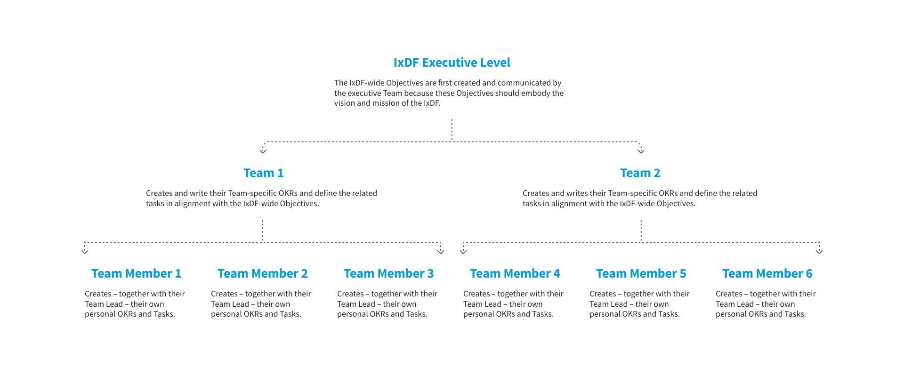
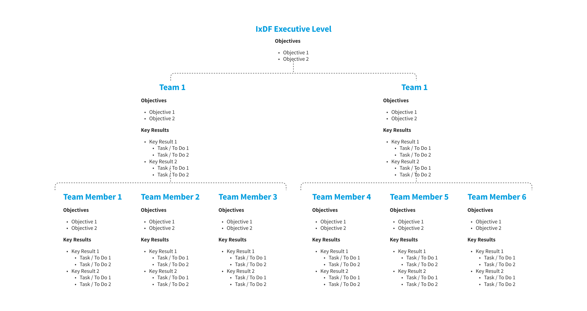
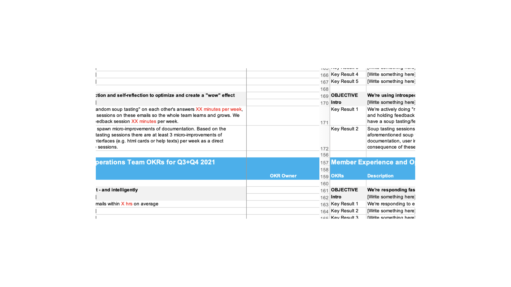
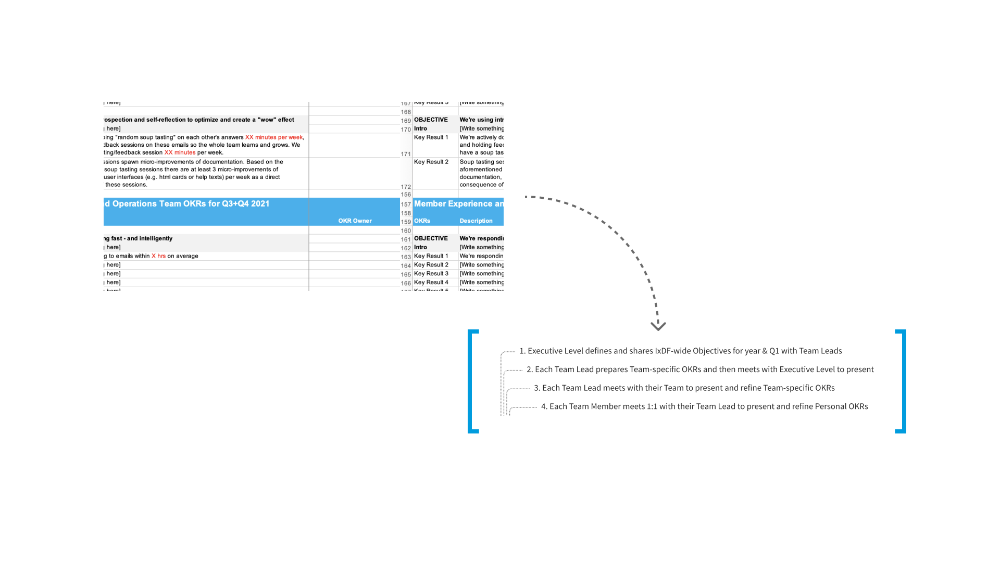
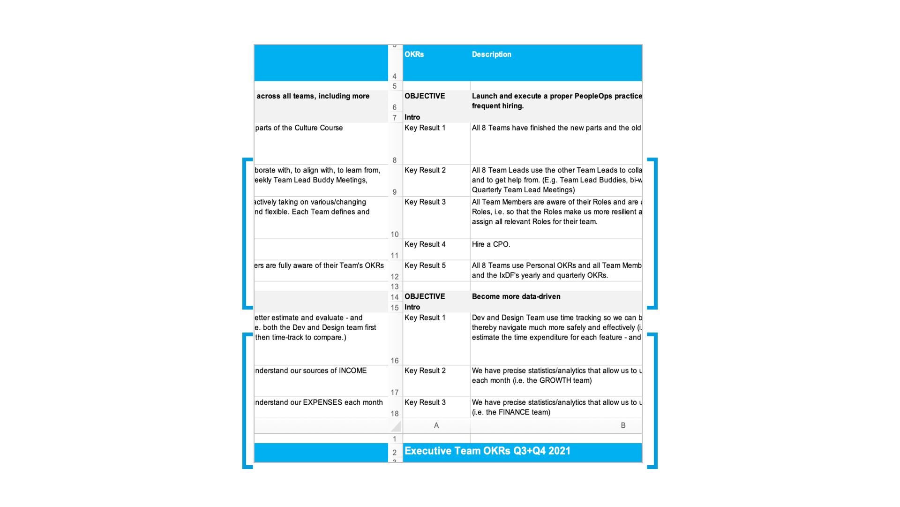
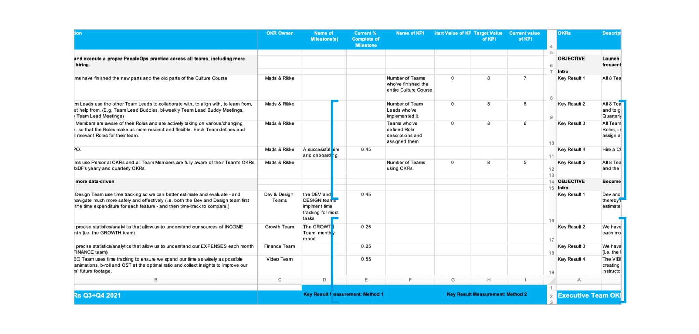

# OKR Process

## The Cascade Process of Creating OKRs for One Quarter

## The OKR Quarter

## Familiarize yourself with the OKR Planning Spreadsheet

## Fill Out Spreadsheet Before Quarterly OKR Meeting

## Define Your Objectives

## Define Your Key Results

## Define Your KPIs

## Ramp Up Your Ambition

## Ensure Your OKRs are S.M.A.R.T

## Hold a Quarterly OKR Meeting

## Prepare Yourself for a Sprint Planning Meeting

## Hold a Sprint Planning Meeting

## Do a Daily Standup

## Prepare for Bi-Weekly OKR 1:1 Check-in Meeting

## Hold the Bi-Weekly Team-wide OKR Check-in Meeting

## Hold the Quarterly Meeting

### Review OKRs

### The Meeting

