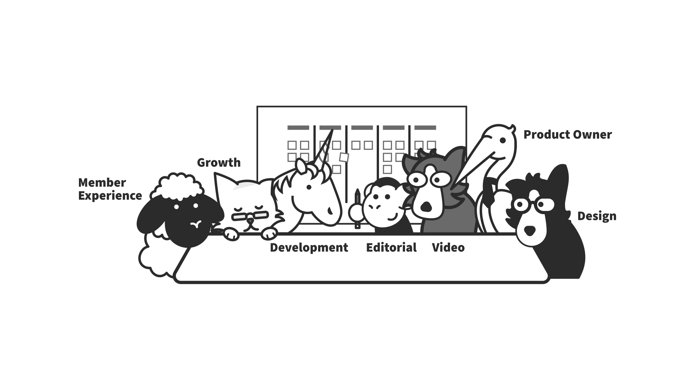
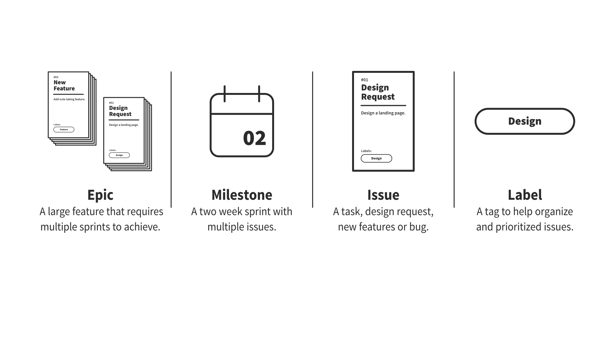
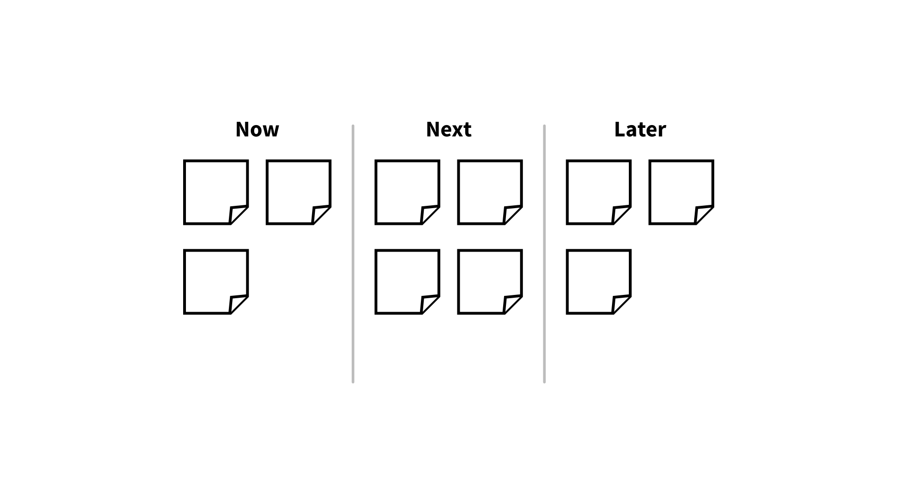
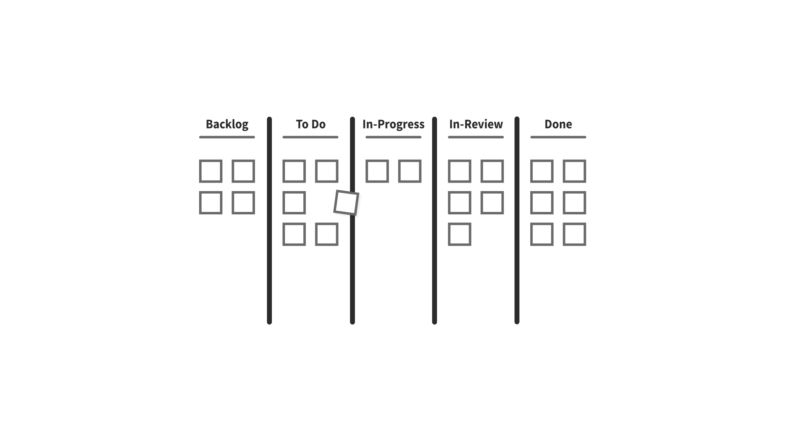
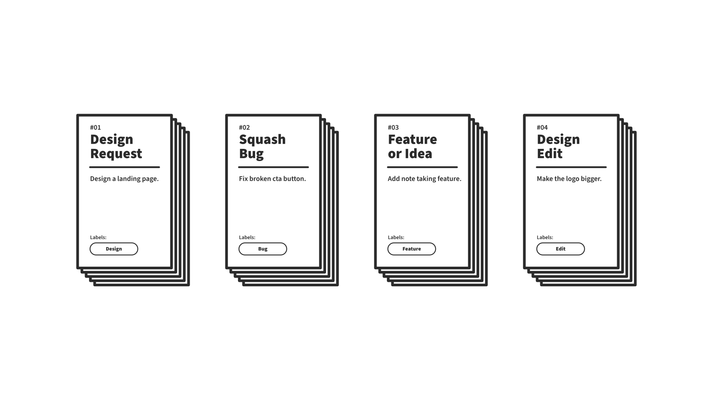
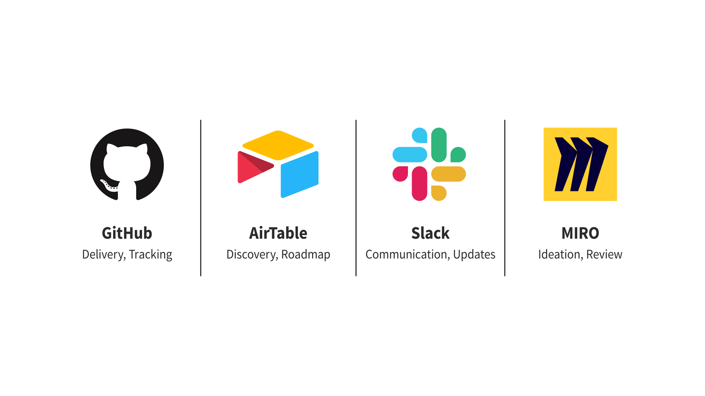
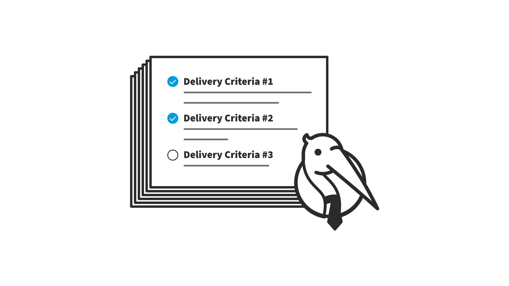
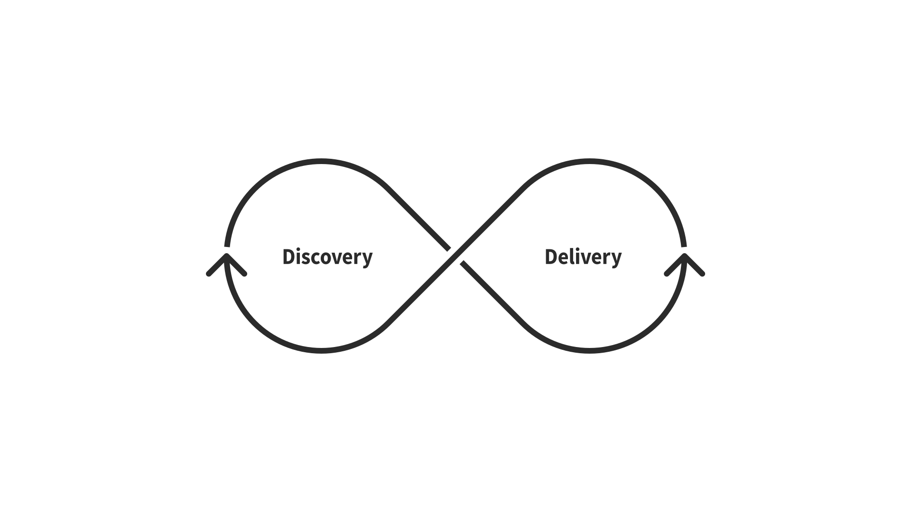
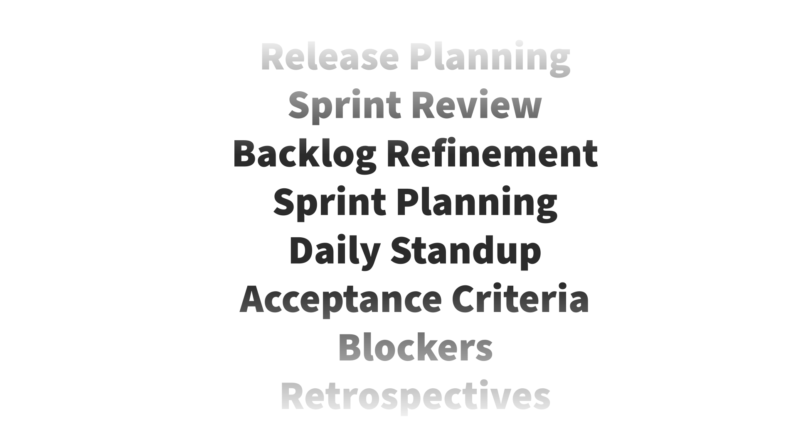

# Delivery Process

This is the process we use to turn product designs into actual products.

## Agile Teams

### Agile Team Members

-   Member Experience
-   Growth
-   Development
-   Editorial
-   Video
-   Product Owner
-   Design

## Agile Organization

Leverage **epics**, **milestones**, **issues** and **labels** to manage execution of tasks.

### Epics

**Epics** are high level product requirements and/or features requests that require multiple issues to achieve. Epics
may extend into multiple milestones “sprints” or continue indefinitely for iterative improvements (e.g. accessibility
improvements).

### Milestones (Sprints)

**Milestones** are bi-weekly “fort-nightly” sprints that are two weeks in duration. Milestone consists of multiple
issues that will be addressed in a given sprint.

-   **Now**: Design related tasks for this sprint.
-   **Next**: Design related tasks for the next sprint.
-   **Later**: Design related tasks for a later sprint.

**Please Note**: Alternative naming conventions for milestones include a **numeric** (#01, #02, #03) or **date** (
DD-MM-YYYY) approaches.

### Scrum Board

**Scrum** is an iterative way of working that focuses on breaking down big projects into small, manageable sprints, with
an emphasis on communication and teamwork — and the scrum board embodies this. This board sits at the center of
everything the team does. It shows how far along they are in the sprint, as well as the overall project.

-   **Backlog**: A full list of issues (edits, features, bugs).
-   **To Do**: Issues that will be tackled during the milestone “sprint.”
-   **In-Progress**: Issues currently being worked on.
-   **In-Review**: Issues ready for review or blocked.
-   **Done**: Issues that have been completed.

### Issues

**Issues** are tasks, design requests, new features or bugs that will be addressed in each milestone.

#### Github Issue Types

-   Design Request: Design a landing page.
-   Bug Report: Fix broken cta button.
-   Feature or Idea: Add note taking feature.
-   Design Edit: Make the logo bigger.

#### How to Create a GitHub Issue?

-   Issue added to Github by a team member. The team member will then assign the appropriate colleague(s) and the issue is
    automatically added to the backlog.
-   Label added to issue (e.g. low-urgency).
-   Issue(s) will be assigned by the appropriate Epic by the team member assigned.
-   Issue(s) will then be placed in a Milestone based on priority during sprint planning.

### Labels

**Labels** are assigned tags that help organize individual issues (e.g. design request, bootcamp, bug) and indicate the
level of priority (e.g. low, medium, high).

## Agile Software

### GitHub

**GitHub** as a way to manage execution of tasks (how, when, what).

-   Leverage Github to track progress of tasks.

### AirTable

**AirTable** to display roadmap, discovery, and gather user research and feedback from the MEx team.

-   Leverage Gantt View to display high-level roadmap.
-   Leverage individual records to gather user feedback and research.

### Docs

**Docs** for notes and documentation (e.g. this document).

### Slack

**Slack** for communication and updates. MIRO MIRO for collaboration and ideation sessions.

## Delivery Criteria

### How to Determine Priority?

Use **Delivery Criteria** to determine priority of issues. The criteria include the **C.H.I.M.E. Metric** of
Maintainability, Impact, Confidence and Ease.

-   **Confidence**: How confident are you in these estimates?
-   **Hypothesis**: What do you think is the ROI on this feature?
-   **Impact**: How much will this feature impact our members?
-   **Maintainability**: How easy is this to maintain over the long-term?
-   **Ease/Effort**: What is the development time investment for this feature?

## Design Decisions

How to Make Design Decisions? In order to create the best possible user experience, you should leverage best practices
to help make decisions. We should ask ourselves; **does it violate any of
our [Design Principles](product/design-principles.md)**?

**If not, then proceed** :)

## Discovery and Delivery Sprints

### Discovery: AirTable

-   Christian comes up with an idea for electric shock-enabled education and adds it to AirTable as a record that is labeled as an **idea**.
-   Christian Mentions the appropriate team members in an AirTable discussion.
    -   Before the next Quarterly/Team OKR.
    -   Team member discussion ensues.
-   Voting may happen, possibly against **delivery criteria**.
-   **Delivery criteria** will determine if the idea is placed in the roadmap. (e.g., does it align with an **Annual/IxDF OKR**? Does it violate our **IxDF design principles**? **M.I.C.E. Score**? **Practical Idealism**?)
-   In the next **Quarterly/Team OKR** meeting, If the idea meets the **delivery criteria**, it is added to the roadmap.
    -   Assigned to the appropriate team(s).
        -   Example: Design and Development team collaborate on new electric shock-enabled feature.
        -   Example: Video, Editorial and Growth teams collaborate on a course promo video.
-   KR’s are defined for it, which could include:
    -   Attributes (e.g. feature should have x, y, z)
    -   Adoption (e.g., x number of users by 21Q4)
    -   Dates (e.g., launch feature by 21Q3)

### Delivery: Github

-   Create related Github epic with associated issues.
    -   Team members assigned, requirements explained, added to milestone (See Sprint Planning Process).
    -   Insert design and/or dev issue template link here.

## Design Meetings

If helpful, you may use these meetings as a guide for your team.

-   **Daily Standup**:
    -   Daily / Monday–Friday / Via Slack
    -   Share what you completed today, what you plan on completing tomorrow, and are there any blockers.
-   **Sprint Planning**:
    -   Bi-Weekly (Fortnightly) / Monday / Via Google Hangouts, Slack or Zoom
    -   Review backlog, determine priority of issues, provide estimates, check goals (i.e. dependencies, clarifications), confirm consensus.
-   **Sprint Retrospective**:
    -   Bi-Weekly (Fortnightly) / Monday / Via Google Hangouts, Slack or Zoom
    -   Share what went well, what could be improved, define actionable tasks to improve the next sprint.
-   **Backlog Refinement**:
    -   Bi-Weekly (Fortnightly) / Monday / Independently Prior to Sprint Planning
    -   Clean up backlog issues, determine priority, make sure issues are in alignment with goals, organize in preparation for planning.

## Design Sprint Planning

If helpful, you may use this sprint planning agenda as a guide for your team.

1. Hellos :)
2. **Team Updates** (i.e. Events, Availability, New Systems, Problems).
3. Collectively **Review Backlog**.
    1. Review backlog, determine priority of issues, provide estimates, check goals (i.e. dependencies, clarifications), confirm consensus.
4. **Determine Priority** of Issues.
    1. Determine the importance of each issue, make sure each issue is understood, be sure it aligns with our organization goals, and discuss if all issues are represented (i.e. avoid unanticipated tasks).
5. **Add the Right Mix** of Issues to the To Do Column.
    1. Reject any unsuitable issues (i.e. redundant, badly defined, too big, team can’t control, etc), move the most likely candidates to the todo column, rank them in priority order.
6. **Check Estimates** & **Assign Work**.
    1. Review workload, add contingency & reserved time for unanticipated issues, determine if we're using everyone’s strengths, are we too ambitious, is anyone overloaded?
7. **Check Goals**.
    1. Any assumptions? Dependencies? Clarifications needed?
    2. Ask questions, flag any potential problems.
    3. Articulate the sprint goals for us to commit to.
8. **Determine** 100% Consensus.
    1. If not, repeat step 3 :)

## Helpful Agile Terms

Below is a list of helpful agile terms.

-   **Daily Standup**: Share what you completed today, what you plan on completing tomorrow, and are there any blockers.
-   **Sprint Planning**: Review backlog, determine priority of issues, provide estimates, check goals (i.e. dependencies, clarifications), confirm consensus.
-   **Sprint Retrospective**: Share what went well, what could be improved, define actionable tasks to improve the next sprint.
-   **Backlog Refinement**: Clean up backlog issues, determine priority, make sure issues are in alignment with goals, organize in preparation for planning.
-   **Blockers**: A blocker is anything that is keeping somebody from performing a specific task.
-   **OKR**: The acronym OKR stands for Objectives and Key Results. The OKR is a popular strategy for goal setting within organizations. It is a collaborative goal-setting tool which we can use to realize our vision and mission in the best possible way.
-   **Objective**: An Objective is a description of a goal to be achieved in the future. An Objective sets a clear direction and provides motivation. An Objective can be thought of as a destination on a map..
-   **Key Result**: A Key Result is a metric with a starting value and a target value that measures progress towards an Objective. A Key Result is like a signpost with a distance that shows how close you are to your Objective.
-   **Task**: A task is a description of the work you’ll do to influence a Key Result. If an Objective is your destination and a Key Result shows the distance to go, a task describes what you’ll do to get there, (take a car, row a boat, etc.).
-   **Annual/IxDF OKRs**: Annual meetings between key stakeholders to discuss organizational OKRs (e.g., culture, hiring, product, editorial courses).
-   **Quarterly/Team OKRs**: Quarterly meetings between teams leads to determine product priorities (e.g., bootcamp grading feature, IxDF shop).
-   **M.I.C.E. Score**: Stands for maintainability, impact, confidence and ease.
-   **Maintainability**: How easy is this to maintain over the long-term?
-   **Impact**: How much will this feature impact those users?
-   **Confidence**: How confident are you in these estimates?
-   **Ease**: What is the time investment for this feature?
-   **S.M.A.R.T.**: Stands for specific, measurable, achievable, realistic and timely.
-   **Discovery**: Product discovery focuses on generating ideas for the backlog.
-   **Delivery**: Product delivery focuses on implementing the discovery ideas.
-   **Impractical Idealism**: Attempting to achieve an idealistic goal—like bringing design education into all corners of the world—using only idealistic success criteria (e.g., maximum number educated, top quality, low cost).
-   **Practical Idealism**: Attempting to achieve an idealistic goal—like bringing design education into all corners of the world—using both idealistic success criteria (e.g., maximum number educated, top quality, low cost) as well as practical criteria (e.g., sustainable growth).
